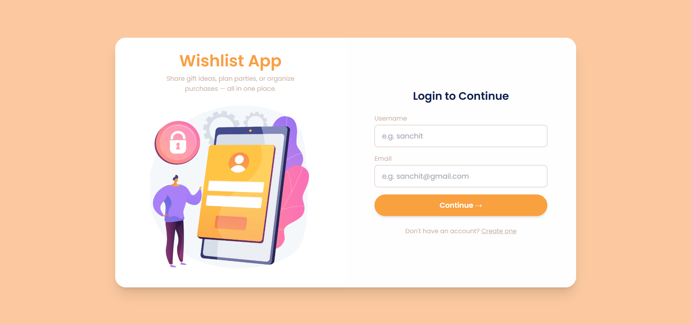
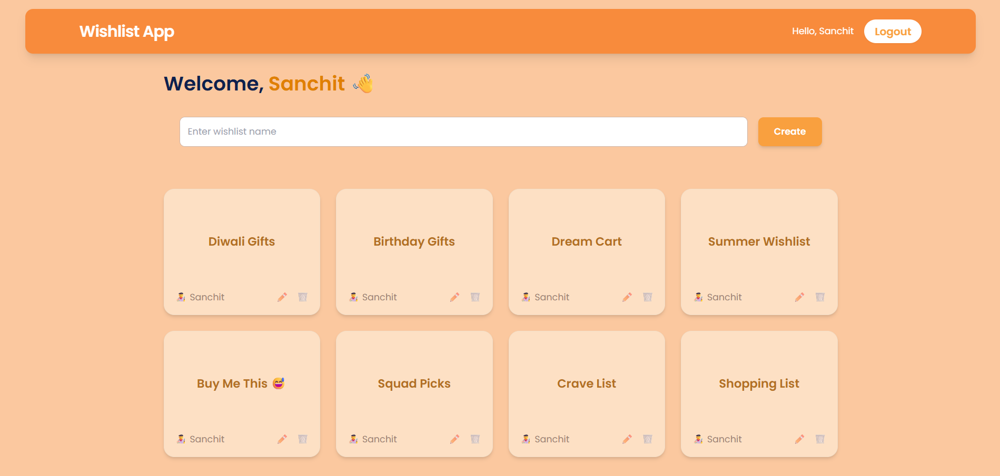
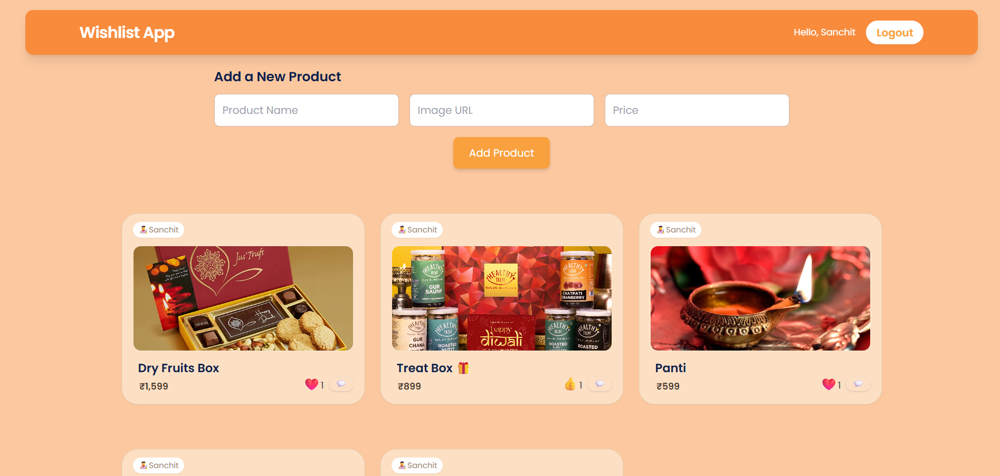
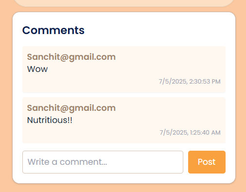

# 🎁 Shared Wishlist App

A full-stack collaborative wishlist application where users can create and share wishlists, add products, react with emojis, and comment in real-time.

---

## 🚀 Live Demo

> 🔗 [Frontend](https://shared-wishlist-app.netlify.app/)  
> 🔗 [Backend API](https://shared-wishlist-app.onrender.com/api)

---

## 📸 Screenshots






---

## 📦 Tech Stack

---
### Frontend (React + TailwindCSS)
- ⚛️ React
- 🎨 Tailwind CSS
- 🎭 Framer Motion (animations)
- 💬 Emoji reactions
- 🔥 Responsive UI with mobile-first design

### Backend (Node.js + Express)
- 🌐 Express API with MongoDB Atlas
- 🔐 dotenv, CORS, axios
- 📦 Models: Wishlist, Product with emoji & comment support

| Database | MongoDB Atlas         |

### Ready for:
- ✅ Real-time sync via `Socket.IO`
- 🔐 Auth integration (optional for future)
---

## 🛠️ Features

- ✅ User login (mocked with localStorage)
- ✅ Create, rename, delete wishlists
- ✅ Add/edit/delete products with:
  - 🧡 Emoji Reactions and count
  - 💬 Comment System
- ✅ Invite mock users
- ✅ Clean UI with animations
- ✅ Mobile responsive
- ✅ Deployed on Render (Node backend)

---

## 📁 Project Structure

```
shared-wishlist-app/
├── wishlist-client/     # React frontend
├── wishlist-server/     # Express backend
```

---

## ⚙️ Setup Instructions

### 1. Clone the Repository

```bash
git clone https://github.com/Sanchit0205/Shared-Wishlist-App.git
cd shared-wishlist-app
```

### 2. Start Backend

```bash
cd wishlist-server
npm install  
touch .env
```

> `.env`
```
MONGO_URI=your_mongodb_connection
PORT=5000
```

```bash
npm start  # or npm run dev
```

### 3. Start Frontend

```bash
cd wishlist-client
npm install
touch .env
```

> `.env`
```bash
REACT_APP_API_BASE_URL=https://your-backend-url.onrender.com/api 
                     
                   # for local
# REACT_APP_API_BASE_URL=http://localhost:5000/api 
```

```bash
npm start
```

---

## ⚡ Assumptions & Limitations

- No user authentication (mocked with localStorage)
- Comments and reactions are stored per product
- No email invite functionality (only mocked)
- Real-time sync logic is ready but not integrated yet (see below)

---

## 🔮 Future Enhancements

- 🔁 Realtime sync using Socket.IO
- 🛡️ User authentication (JWT/Firebase)
- 📦 Product search & filters
- 🗃️ Pagination for large wishlists
- 📱 PWA support

---

## ✨ How I'd Scale This App

- Use **Socket.IO** to broadcast product/comment changes instantly
- Store users in DB for proper invite tracking
- Add **Redis** for reaction counters
- Cache frequently accessed wishlists
- Implement **role-based permissions** (owner vs. contributor)
---

## 👨‍💻 Made with ❤️ by Sanchit Chavan
